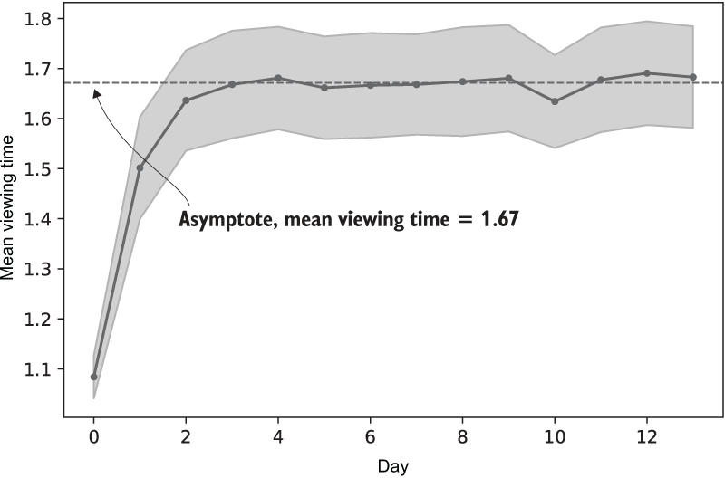
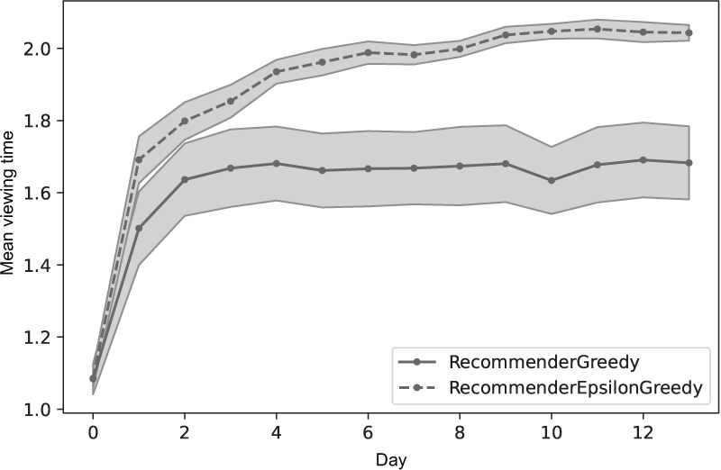
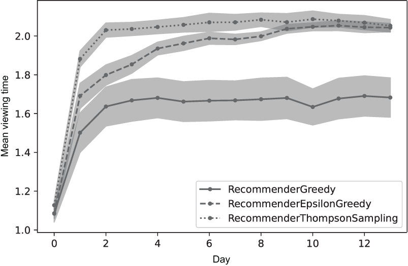
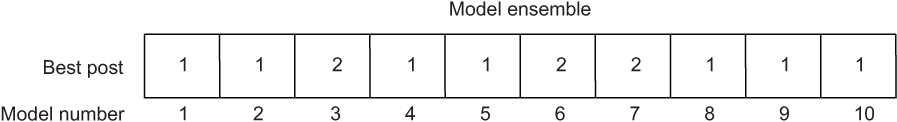

# Contextual Bandits - Making targeted decisions

So far: A/B testing and multi-armed bandits can evaluate arbitrary changes, and RSM optimizes a small number of continuous parameters.

Contextual bandits can optimize multiple (potentially illions) of system parameters  -but only for a narrowly defined type of system consisting of
1. a model that predicts the short term business-metric outcome of a decision
2.  a component that makes decisions based on the model's predictions

Basic outline: optimize with a greedy algorithm, then epsilon-greedy, then Thompson sampling.

## Model a  business metric offline to make decisions online

First-pass attempt at building a contextual bandit:
1. Fit a rediction model from logged data
1. Make decisions in production based on the model's predictions

This is called a *greedy contextual bandit* 

The contextual bandit (CB) is typified by a recommender system (suggests content - e.g. blogs, movies, songs, &c.). 

Consists of an offline part where you fit a business metric predictor on logged data and on online part where you then make prediction and take actions based on the training (then iterate).

### Model the business=metric outcome of a decision

Say you're an ML engineer working on a social media app. It shows a piece of text (a 'post') to the user, selected from a larger group called the 'inventory'.

Our goal is to show users what they want to see, as measured by engagement. For us, that is `viewing time`, and is the business metric that we'll be focusing on.

We want to model

$$
\text{viewing time} = f(\text{user}, \text{post})
$$

In CB-speak, the user is called the *context*, the act of displaying the post is the *action*, and the viewing time is the *reward*.

#### Simulate the viewing time

Let's simulate the measurement of viewing time. Then we'll fit a prediction model to the output.

```python
import numpy as np

def measure_viewing_time(context, action_weights):
    return np.exp(context * action_weights).mean() + 0.1 * np.random.normal()
```

We simulate the viewing time as a random number with mean depending on the `context` and `viewing_weights`.

The `context` is a vector containing the features that describe the user. They may be demographic information, interest, &c.

The `action_weights` are different. They model how a user (`context`) responds to different posts. We can't observe `action_weights`, they're just here to make a simulator. We'll set it equal to the output of `np.random.normal` and leave it unchanged for the rest.

#### Fit the prediction model

You fit the prediction model offline periodically (say weekly or whatnot).

```python
class Sample:
    def __init__(self, context, action, reward) -> None:
        self.context = context # the user
        self.action = action # displayed post
        self.reward = reward # viewing time
```

For each post, model the reward (`viewing time`) as a linear function of the context vector:

$$
\text{reward} = \beta * \text{context} + \epsilon
$$

or, if `y = reward` and `X = context`, then

$$
y = X \beta + epsilon
$$

This looks like linear regression! We'll run one linear regression for each of the `num_actions` posts.

```python
def collect_logs_by_action(num_actions, logs):
    samples_y = [[] for _ in range(num_actions)]
    samples_x = [[] for _ in range(num_actions)]
    for sample in logs:
        samples_y[samples.action].append(sample.reward)
        samples_x[samples.action].append(sample.context)
    return sample_x, samples_y

def build_models(num_features, samples_y, samples_x):
    """ Build a model performs one linear regression on each of the num_actions set of samples, given that there are num_features features in each context (user) """
    betas = []
    for y, x in zip(samples_y, samples_x):
        y = np.array(y)
        x = np.array(x)
        if len(y) > 0:
            beta = np.linalg.pinv(X.T @ X) @ (X.T @ y)
        else:
            beta = np.zeros(shape=(num_features,))
        betas.append(beta)
    return betas
```

---

Note that we are using `pinv` instead of `inv`. This calculates the pseudo-inverse, which is equal to the inverser when it exists but also exists for some other cases, like when there are too few samples of where the regressors are too similar to each other. We are thinking of it like a more 'robust' version of the inverse that is useful for linear regressions.

---

So now we have the components for the offline portion - now we need the online one.

### Add the decision-making component

Since we're using the *greedy* algorithm, when a user requests a post, we'll check each post for the predicted viewing time (reward) and show them that one!

In CB-speak, the decision-making component is called a *policy*.

```python
class RecommenderGreedy:
    def __init__(self, num_features, num_actions) -> None:
        self._num_features = num_features
        self._num_actions = num_actions
    
    def reset(self):
        self._betas = [np.random.normal(size=(num_features,)) for _ in range(self._num_actions)]

    def fit_offline(self, logs):
        samples_y, samples_x = collect_logs_b_post(num_actions, logs)
        self._betas = build_models(self._num_features, samples_y, samples_x)

    def policy(self, context):
        """ Decide which post to display """
        viewing_max = -np.inf()
        for action in range(self._num_actions):
            viewing_hat = contact @ self._betas[action] # estimated viewing time
            if viewing_hat > viewing_max:
                action_best = action
                viewing_max = viewing_hat
        return action_best
```

### Run and evaluate the greedy recommender

Since we're trying to maximize viewing time, a natural metric to track is the average viewing time per post. We'll take the mean over a day, since that's the period over which we're training the model.

We'll run a simulation for 30 days and see how it performs. The simulation uses `num_features = 5` and `num_actions = 30`.



---

Note that contextual bandits focus only on the one-step (short-term) reward. For instance, if the reward from one post depended on the previously viewed post, that would be entirely missed.

---

This kind of system works pretty well. However, it is missing the exploration aspect! We'll fix this with an epsilon-greedy recommender.

## Explore actions with epsilon-greedy

The problem with the greedy algorithm is not enough exploring. What if showing a different post would have been better? You'd never know, because the system always dislays the one that it thinks is the best, with no allowance for uncertainty. We're missing the *counterfactual*.

### Missing counterfactuals degrade predictions

Let's see the effect of missing counterfactuals. Imagine the recommender system logged the following three samples from displaying post #1 three times:


```python
contexts = [
    [1, 0, 0],
    [0, 1, 0],
    [0, 0, 1],
]

rewards = [
    0.6,
    0.9,
    1.3
]
```

We can fit a model to this data:

```python
x = np.array(contexts)
y = np.array(rewards)
beta_1 = np.linalg.pinv(x.T @ x) @ (x.T @ y)
beta_1
```
    array([0.6, 0.9, 1.3])

Say User A with `[0, 0, 1]` arrives. This happens to be the third user, so we predict `[0, 0, 1] @ beta_1 = 1.3` as the viewing time.

However, imagine that the third user had never been shown post #1, so our data was missing that third row - we didn't have the counterfactual. Then

```python

contexts = [
    [1, 0, 0],
    [0, 1, 0],
]

rewards = [
    0.6,
    0.9,
]

x = np.array(contexts)
y = np.array(rewards)
beta_m = np.linalg.pinv(x.T @ x) @ (x.T @ y)
print(f"{beta_m=} -> predicted viewing time {beta_m @ np.array([0, 0, 1])}")
```
    beta_m=array([0.6, 0.9, 0. ]) -> predicted viewing time 0.0

So this is obviously a pretty bad prediction.

#### Feedback Loops

This can result in fedback loops - the system won't ever show post #1 to users like A, which means the data is missing, meaning it won't show them the post, meaning the data is missing...

In practice the feedback loops can be more subtle. You should always behave as though they might be present.

### Exploring with epsilon-greedy to collect counterfactuals

We would like some experimentation. We can use the epsilon-greedy algorithm from before. Recall: the process is to be greedy 90% (or whatever) of the time and choose a random post the other 10%.

```python
class RecommenderEpsilonGreedy:
    def __init__(self, num_features, num_actions, epsilon=0.1) -> None:
        self._num_features = num_features
        self._num_actions = num_actions
        self._epsilon = epsilon
    
    def reset(self):
        self._betas = [np.random.normal(size=(num_features,)) for _ in range(self._num_actions)]

    def fit_offline(self, logs):
        samples_y, samples_x = collect_logs_b_post(num_actions, logs)
        self._betas = build_models(self._num_features, samples_y, samples_x)

    def policy(self, context):
        """ Decide which post to display """
        viewing_max = -np.inf()
        if np.random.uniform(0, 1) < self._epsilon:
            # choose a random one
            action_best = np.random.randint(0, self._num_actions)
        else:
            # otherwise be greedy
            for action in range(self._num_actions):
                viewing_hat = contact @ self._betas[action] # estimated viewing time
                if viewing_hat > viewing_max:
                    action_best = action
                    viewing_max = viewing_hat
        return action_best
```



## Explore parameters with Thompson sampling

[[Thompson Sampling]] explores more efficiently the epsilon-greedy, exploring a lot when there is a lot of uncertainty and little when there is little.

This requires changes to both the online and offline portions of the model.

1. Each day, build a varied set of models, called the *ensemble*
1. Put the entire ensemble of models online
1. For each decision, the policy randomly selects a model from the ensemvle, then displays the post predicted by that mode to have the highest viewing time

At decision time, Thompson sampling selects a model rather than randomly choosing an action, like we did with epsilon-greedy. In this case, Thompson sampling is an exploration over parameters and epsilon-greedy is exploration over actions.

### Create an ensemble of prediction models

If you run the fit using different inputs (logged values), you'll get different outputs. What you can do is take a single set of logged values and create 10 bootstrapped samples from it and fit a model for each bootstrapped sample.

```python
class RecommenderThompsonSampling:
    def __init__(self, num_features, num_actions, num_bs_samples) -> None:
        self._num_features = num_features
        self._num_actions = num_actions
        self._num_bs_samples = num_bs_samples
    
    def reset(self):
        self._betas = []
        for _ in range(self._num_actions):
            self._betas.append([
                np.random.normal(size=(num_features,)) for _ in range(self._num_actions)
            ])

    def _bs_sample(self, samples_y, samples_x):
        bs_samples_y = []
        bs_samples_x = []
        for action in range(self._num_actions):
            y = np.array(samples_y[action])
            x = np.array(samples_x[action])
            if len(y) > 0:
                i = np.random.randint(0, len(y), size=(len(y),))
                y = y[i]
                x = x[i,:]
            bs_samples_y.append(y)
            bs_samples_x.append(x)
        return bs_samples_y, bs_samples_x

    def fit_offline(self, logs):
        fit_logs = logs
        samples_y, samples_x = collect_logs_by_action(num_actions, fit_logs)
        self._betas = []
        for _ in range(self._num_bs_samples):
            bs_samples_y, bs_samples_x = self._bs_sample(samples_y, samples_x)
            self._betas.append(build_models(self._num_features, bs_samples_y, bs_samples_x))

    def policy(self, context):
        """ Decide which post to display """
        i_beta = np.random.randint(0, len(self._betas))
        beta = self._betas[i_beta]
        viewing_max = -np.inf()
        for action in range(self._num_actions):
            viewing_hat = context @ self._betas[action] # estimated viewing time
            if viewing_hat > viewing_max:
                action_best = action
                viewing_max = viewing_hat
        return action_best
```



Thompson sampling has optimal regret ($T^{\frac{1}{2}}$, where $T$ is the fitting time).

### Randomized probability matching

Thompson sampling achieves higher business metrcis because it is more nuanced in its exploration. Since each model was fit with slightly different data, it will give slightly different outputs. For instance, say the following are the results of one run of the model:



7 / 10 models predict the post #1 is the best. Since we're choosing the models at random, that means that we will select that 70% of the time; the other 30% of the time we select post #2. We are selecting an action according to the rule

$$
p(\text{action}) = p_{\text{best}}(\text{action})
$$

## Validate the CB

You probably want to run an A/B test whenever you're changing the system like that. Jsut be sure to run the AB test against the *peak* of the post-CB changes to allow for the time that it takes to actually improve.


