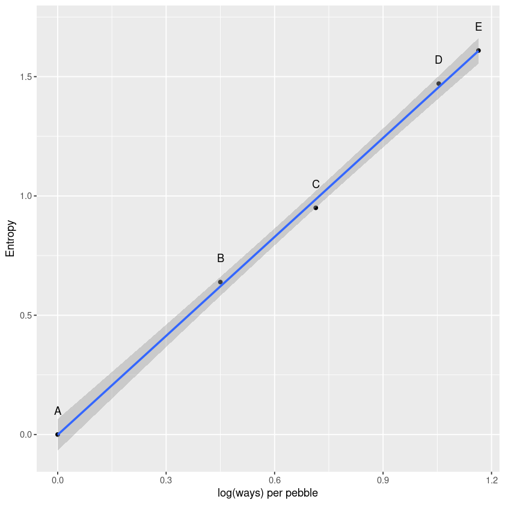

- Entropy: things that can happen vastly more ways are more likely
- Entropy can help us to chose our priors and likelihoods
- When going beyond the conventional, it's helpful to have a principle to guide us. One principle: choose the distribution with the highest entropy. 3 Justifications:
    - Distribution with the biggest entropy is the widest and least informative distribution that is still consistent with what we believe.
    - Nature tends to produce empirical distributions with high entropy. E.g. lots of things are normally distributed; normal distribution contains no information *except* the mean and variance; any other distribution would entail making more assumptions. Natural processes other than addition also tend to produce maximum entropy distributions, but they're not normal.
    - Regardless of why it works, it tends to work.
- This chapter is an introduction to [[Generalized Linear Model]]s and the principle of [[Maximum Entropy]]. A [[Generalized Linear Model|GLM]] is much like the linear regression we've already looked at. It's a model that replaces a parameter of a likelihood function with a linear model. [[Generalized Linear Model|GLMs]] need not use [[Normal Distribution|Gaussian]] likelihoods. Any likelihood function can be used, and linear models can be attached to any / all of the parameters.
- Principle of [[Maximum Entropy]] can help us to choose likelihood functions

## 1 Maximum Entropy
in [[SR - Chapter 7 - Ulysses' Compass|Chapter 7]] we looked at the basics of information theory. Reminder: unique measure of the uncertainty of a probability distribution $p$ is is the [[Information Entropy]]

$$
H(p) = -\sum p_i \log(p_i)
$$

Simple way to state the maximum entropy principle:

> The distribution that can happen the most ways is also the distribution with the biggest information entropy. The distribution with the biggest entropy is the most conservative distribution that obeys its constraints.

To build some intuition:

Imagine 5 buckets and a pile of 10 individually numbered pebbles. You stand and toss all 10 pebbles such that each pebble is equally likely to land in any of the buckets. Every arrangement of the pebbles is equally likely - equal probability to get all 10 in bucket 3 as to get pebble 1 in bucket 2, 2-9 in bucket 3, and pebble 10 in bucket 4.

Despite this, some arrangements are far more likely. There is only 1 way to get all pebbles in bucket 3, but 90 ways to get 1 in bucket 2, 2-9 in bucket 3, and 10 in bucket 4.


```R
p <- list()
p$A <- c(0, 0, 10, 0, 0)
p$B <- c(0, 1, 8, 1, 0)
p$C <- c(0, 2, 6, 2, 0)
p$D <- c(1, 2, 4, 2, 1)
p$E <- c(2, 2, 2, 2, 2)

# normalize so it's a probability distribution
p_norm <- lapply(p, function(q) q / sum(q))

# compute the information entropy, remembering L'Hopital's Rule (for when $p=0$)
H <- sapply(p_norm, function(q) -sum(ifelse(q==0, 0, q*log(q))))
H
```


<style>
.dl-inline {width: auto; margin:0; padding: 0}
.dl-inline>dt, .dl-inline>dd {float: none; width: auto; display: inline-block}
.dl-inline>dt::after {content: ":\0020"; padding-right: .5ex}
.dl-inline>dt:not(:first-of-type) {padding-left: .5ex}
</style><dl class=dl-inline><dt>A</dt><dd>0</dd><dt>B</dt><dd>0.639031859650177</dd><dt>C</dt><dd>0.950270539233235</dd><dt>D</dt><dd>1.47080847632211</dd><dt>E</dt><dd>1.6094379124341</dd></dl>


E, the one with the most ways of being realized, has the highest entropy. Let's see why: compute the logarithm of the number of ways each can be realized, then divide the logarithm by 10, the number of pebbles. This gives us the log ways per pebble for each distribution:


```R
ways <- c(1, 90, 1260, 37800, 113400)
logwayspp <- log(ways) / 10
```


```R
plot_df <- data.frame(
    label=c("A", "B", "C", "D", "E"),
    entropy=H,
    logwayspp=logwayspp
)
head(plot_df)
```


<table class="dataframe">
<caption>A data.frame: 5 × 3</caption>
<thead>
	<tr><th></th><th scope=col>label</th><th scope=col>entropy</th><th scope=col>logwayspp</th></tr>
	<tr><th></th><th scope=col>&lt;chr&gt;</th><th scope=col>&lt;dbl&gt;</th><th scope=col>&lt;dbl&gt;</th></tr>
</thead>
<tbody>
	<tr><th scope=row>A</th><td>A</td><td>0.0000000</td><td>0.0000000</td></tr>
	<tr><th scope=row>B</th><td>B</td><td>0.6390319</td><td>0.4499810</td></tr>
	<tr><th scope=row>C</th><td>C</td><td>0.9502705</td><td>0.7138867</td></tr>
	<tr><th scope=row>D</th><td>D</td><td>1.4708085</td><td>1.0540064</td></tr>
	<tr><th scope=row>E</th><td>E</td><td>1.6094379</td><td>1.1638677</td></tr>
</tbody>
</table>

```R
library(ggplot2)
```
```R
ggplot(plot_df, aes(logwayspp, entropy)) +
    geom_point() +
    geom_smooth(method='lm', formula=y~x) +
    geom_text(aes(label=label), nudge_y=0.1) +
    xlab("log(ways) per pebble") +
    ylab("Entropy")
```


 
    

We call the distribution that can happen the greatest number of ways the [[Maximum Entropy Distribution]]; it's the most plausible distribution.

### 1.1 Gaussian

In natural systems, when you have lots of small things adding up, you tend to get a [[Normal Distribution|Gaussian]]. We saw this in [[SR - Chapter 4 - Geocentric Models|Chapter 4]], with the coin-flipping.

Maximum entropy seeks the distribution that can arise the largest number of ways. It also seeks the 'flattest' distribution that is consistent with the data.

In order to visualize how the [[Normal Distribution|Gaussian]] is the most even distribution for a given variance, let's look at the [[Generalized Normal Distribution]]:

$$
\text{Pr($y|\mu, \alpha, \beta$)} = \frac{\beta}{2\alpha \Gamma(1 / \beta)}e^{-\left( \frac{|y - \mu}{\alpha} \right)^\beta}
$$

Basic idea: if all that we're willing to assume about a collection of measurements is that they have a finite variance, then we will get the [[Normal Distribution|Gaussian]] distribution. However, if we assume more then we'll get a different distribution!

### 1.2 Binomial

In [[SR - Chapter 2 - Small Worlds and Large|Chapter 2]], we talked about Bayesian updating by drawing marbles from a bag. The likelihood ended up being a [[Binomial Distribution]], with

$$
Pr(y|n,p) = \frac{n!}{y!(n-y)!}p^y(1-p)^{n-y}
$$

We can also think about the probability of *any unique sequence of events* as being

$$
Pr(y_1, y_2, \dots, y_n) = p^y (1-p)^{n - y}
$$

We can verify that the binomial distribution is the one that maximizes the entropy by manually testing other distributions. The constraint in this case is that the expected number of blue marbles in two draws is 1.

## 2 Generalized linear models

[[Normal Distribution|Gaussian]] models of the previous chapter worked by assuming a [[Normal Distribution|Gaussian]] over the outcomes. Then we replaced the mean with a linear model, like so:

$$
\begin{align*}
y_i &\sim \text{Normal}(\mu_i,\sigma) \\
\mu_i &= \alpha + \beta x_i \\
\end{align*}
$$

For an outcome variable that is continuous and far from any theoretical max or min, this sort of Gaussian model has maximum entropy.

However, when the outcome variable is either discrete or bounded, this can't be trusted to do much more than estimate the mean.

Luckily, we can do better. By using our knowledge about the outcome variable and appealing to maximum entropy, we can generalize the linear regression strategy - replace a parameter describing the shape of the likelihood with a linkear model - to probability distributions other than the **Gaussian**.

This is the essence of the [[Generalized Linear Model]]. The models now look like this:

$$
\begin{align*}
y_i &\sim \text{Binomial}(n, p_i) \\
f(p_i) &= \alpha + \beta (x_i - \bar{x}) \\
\end{align*}
$$

There are two changes here as compared to the regular Gaussian model.

1. The likelihood is [[Binomial Distribution|binomial]], not [[Normal Distribution|Gaussian]]. This is our appeal to maximum entropy - for a count outcome with each outcome arising from $n$ trials and constant expected value $np$, the [[Binomial Distribution|binomial]] is the least informative distribution which satisfies our prior knowledge (maximum entropy)
2. There is now a function $f$ representing the [[Link Function]], to be determined separately from the choice of distribution. Generalized linear models need a link function because there is only rarely a $\mu$ parameter representing the average outcome, and also the parameters are rarely unbounded in each direction.

### 2.1 Meet the family

The most common distributions used in statistical modelling are members of a family known as the [[Exponential Family]]. Every member of the family is a maximum entropy distribution for some set of constraints. Conveniently, just about every other statistical modelling tradition employs the same distributions, even though they arrive at them via justifications other than maximum entropy.

Two of the distributions, the [[Normal Distribution|Gaussian]] and [[Binomial Distribution|binomial]], are the most commonly used distributions in applied statistics through [[Linear Regression]] ([[SR - Chapter 4 - Geocentric Models|Chapter 4]]) and [[Logistic Regression]] ([[SR - Chapter 11 - God Spiked the Integers|Chapter 11]]).

The [[Exponential Distribution]] is constrained to be zero or positive. It is a distribution describing distance or duration, kinds of measurements that describe a displacement in space / time. If the probability of an event is constant in space or time, then the distribution of events tends toward the **exponential**. Shape is described by a single parameter, $\lambda$ (rate of events) or $\lambda^{-1}$, the average displacement. The [[Exponential Distribution|exponential]] is core to survival or event history analysis (not in this book).

The [[Gamma Distribution]] is also zero or positive. Also a fundamental distribution of distance / duration. The difference between the [[Gamma Distribution]] and the [[Exponential Distribution]] is that the gamma can have a peak above zero. Has maximum entropy for all distributions with the same mean and the same average logarithm. Shape is described by two parameters, but there are several common parameterizations. Common in survival and event history analysis, as well as some contexts where a continuous measurement is constrained to be positive.

The [[Poisson Distribution]] is a count distribution, like the [[Binomial Distribution]]. It is actually a special case; as $n \to \infty$ and $p \to 0$, then the [[Binomial Distribution|binomial]] converges to a [[Poisson Distribution|poisson]] with $\lambda = np$. Practically, the [[Poisson Distribution|poisson]] is used for counts the never get close to any theoretical maximum.

### 2.2 Linking linear models to distributions

To build a regression model from any of these exponential family distributions just means attaching a linear model to one or more of the parameters that describes the distribution. However, we often need a [[Link Function]] to make sure that no mathematical accidents occur (e.g. a parameter being constrained to be non-negative, &c.)

For instance:

$$
\begin{align*}
y_i &\sim \text{Zaphod}(\theta_i, \phi) \\
f(\theta_i) &= \alpha + \beta(x_i - \bar{x})
\end{align*}
$$

Here, $f$ is the [[Link Function]]. The job of a link function is to map the linear space of the model ($\alpha + \beta (x_i - \bar{x})$) into the non-linear space of the parameter $\theta_i$. Most of the time you can use one of two very common link functions: a [[Logit Link]] or a [[Log Link]].

The [[logit link]] maps a parameter that is defined as a probability mass (and so must lie in $[0, 1]$) onto a linear model that can take any real value. In the context of a model definition, it looks like this:

$$
\begin{align*}
y_i &\sim \text{Binomial}(n, p_i) \\
\text{logit}(p_i) &= \alpha + \beta x_i \\
\end{align*}
$$

And the logit function itself is defined as the **log-odds** $\text{logit}(p_i) = \log \frac{p}{1 - p_i}$. The *odds* of an event are just the probability that it happens divided by the probability that it doesn't happen, so this just says that

$$
\log \frac{p_i}{1 - p_i} = \alpha + \beta x_i
$$

We can easily solve this for $p_i$:

$$
p_i = \frac{e^{\alpha + \beta x_i}}{1 + e^{\alpha + \beta x_i}}
$$

This is the [[Logistic Function]], which in this context is often called the *inverse-logit*.

The other common link function is the [[Log Link]]. This maps a parameter over the positive real values onto a linear model. For instance, say we want to model the standard deviation $\sigma$ of a normal variable. This needs to be positive and greater than 0, so our model might look like this:

$$
\begin{align*}
y_i \sim \text{Normal}(\mu, \sigma_1) \\
\log (\sigma_i) = \alpha + \beta x_i \\
\end{align*}
$$

Again, we can easily solve this for $\sigma_i$:

$$
\sigma_i = e^{\alpha + \beta x_i}
$$

### 2.3 Omitted Variable Bias

Back in [[SR - Chapter 5 - The Many Variables and the Spurious Waffle|Chapter 5]] and [[SR - Chapter 6 - The Haunted DAG and the Causal Terror|Chapter 6]], we saw examples of [[Omitted Variable Bias]], where leaving a causally important variable out of the analysis led to biased inference. It can be worse in [[Generalized Linear Model|GLMs]], since even a variable that isn't a confounder can bias the results. The reason has to do with the ceiling and floor effects mentioned earlier.

Say we have a binary outcome $Y$ that is affected by both $X$ and $Z$. If either is large enough, then $Y = 1$. If we only measure $X$, then we'll think that it doesn't affect $Y$ (since we are missing the causal effect of $Z$). This doesn't happen in regular linear models because the missing variable will just contribute to the mean.

There is no way to avoid this; falling back to a regular linear model doesn't remove the bias, it just disguises it.

### 2.4 Absolute and relative differences

Practical consideration: different link functions expand / compress different regions of the parameter space. Parameter estimates don't tell you the importance of the predictor on the outcome. Each parameter represents arelative difference on the scale of the linear model, ignoring other parameters. In reality, we are interested in the *absolute* differences in the outcome.

This point will come up again in later chapters.

### 2.5 GLMs and Information Criteria

Tempting to choose lots of link functions and likelihoods and let [[Widely Applicable Information Criterion|WAIC]] or whatever sort it out. Unfortunately, it doesn't work that way; [[Information Criteria]] can only be used to directly compare models with the same outcome distribution. There are ways to compare these different models, but not with [[Information Criteria]]. We will look at these later.

## 3 Maximum entropy priors

The principle of maximum entropy can help us to choose priors. Sometimes we actually do have some information that we want to incorporate into the priors, and in these cases choosing a maximum entropy prior can be a conservative choice (since we are making as few additional assumptions as possible).