# Chapter 2 - Small Worlds and Large Worlds

Mathematical modelling has two frames:
1. The 'small world' of the model, in which everthing is known
2. The 'large world' of reality, in which there are 'unknown unknowns'

Bayesian analysis is based on counting the number of ways that things can occur, and choosing the possibility that is most likely

**2.1.1** Suppose there is a bag full of marbles, either blue or white. There are exactly four possibilities:
- WWWW
- BWWW
- BBWW
- BBBW
- BBBB

These can be thought of as the conjectures.

Now you draw three marbles (with replacement): BWB. Which of the possibilities is most plausible?

You can draw out the possibilities using a tree diagram to figure out in how many ways each conjecture could give rise to the observed data. If we count them out, we get:
- WWWW -> 0
- BWWW -> 3
- BBWW -> 8
- BBBW -> 9
- BBBB -> 0

We are almost there, but not quite. *If* each of the conjectures were equally likely, then we could just choose the one with the most ways of producing the data. However, we might have additional data about the probability of the conjectures being correct!

For now though, let's say that we believe the conjectures to be equally likely. Now however, we draw another marble out, and see that it is blue. We can update our table:

|Conjecture | Ways to produce new B | Prior counts | New Count|
|--- | --- | --- | --- |
|WWWW | 0 | 0 | 0 x 0 = 0 |
|BWWW | 1 | 3 | 1 x 3 = 3|
|BBWW | 2 | 8 | 2 x 8 = 16|
|BBBW | 3 | 9 | 3 x 9 = 27|
|BBBB | 4 | 0 | 4 x 0 = 0|

This looks like an update: posterior = prior * likelihood!

```R
# We can do a similar update in R!
ways <- c(0, 3, 8, 9, 0)
ways / sum(ways)
```


<style>
.list-inline {list-style: none; margin:0; padding: 0}
.list-inline>li {display: inline-block}
.list-inline>li:not(:last-child)::after {content: "\00b7"; padding: 0 .5ex}
</style>
<ol class=list-inline><li>0</li><li>0.15</li><li>0.4</li><li>0.45</li><li>0</li></ol>

These are exactly how plausible we find each conjecture!

## Building a model

Suppose that we have a globe representing the earth. You want to know how much of the surface is water vs land, so you toss the globe up 9 times and see which is touching the ground. You get the following results:

WLWWWLWLW

(6 water, 3 land) - this is our *data*.

Now we need to make some assumptions, and these assumptions constitute the model. Designing a Bayesian model benefits from the following design steps:
1. Data story: motivate the model by narrating how the data might arise
1. Update: educate your model by feeding it data
1. Evaluate: All statistical models require supervision, leading to model revision

**The Data Story**
For us, let's explain hwo the data was born:
- The true proportion of water covering the globe is $p$.
- A single toss of the globe has a probability $p$ of production a W observation, and probability $1-p$ of producing an L observation
- Each toss of the globe is independent of the others

This story is then translated into a formal probabilistic model.

**Bayesian Updating**
We do that with the data!

**Evaluate**
A Bayesian process can be proven to be the optimal way to update our beliefs, gievn the data, and _given that the model is an accurate description of reality_.

## Components of the Model

- Variables: In our model, there are three variables
    - $p$, the proportion of water. We cannot observe $p$ directly in the data. Because we don't observe it directly, we call it a *parameter*.
    - The other variables are the observed ones, the count of land ($L$) and water ($W$). We can combine them to get the total number of observations, $N = L + W$.

- Definitions:
    - We must relate our variables to each other
    - E.g. for each value of $p$, we can calculate how likely each combination of $W$ and $L$ would be (the *likelihood* of the data)

$$
Pr(W,L|p) = \frac{(W+L)!}{W!L!} p^W (1-p)^L
$$

We should read this as 
> The counts of "water" W and "land" L are distributed binomially, with probability $p$ of "water" on each toss.

We can easily calculate this in R:


```R
dbinom(6, size=9, prob=0.5)
```
0.1640625

(Note: in R many distributions calculate their densities with `d`. These often have ways of getting a random sample (`r`) and calculating the cumulative distribution (`p`).

For every parameter in our model, we need to provide some initial distribution of prior plausibility. We have to use our actual knowledge to get at this!

With all of the above work, we can write down the model:

$$
\begin{align*}
W &\sim \text{Binomial}(N, P) \\
p &\sim \text{Unifom}(0, 1)
\end{align*}
$$

## Making the Model Go

Now that we have the starting point, we can update the prior distributions to the *posterior*, using the data. In our case, it will be using $Pr(p|W,L)$ - the probability of each $p$, given the observed data.

The mathematical way of calculating this is Bayes' Theorem.

There are many methods to "do" the Bayesian calculations. In this book, there are three:
1. Grid approximations
2. [[Quadratic Approximation]]
3. [[MCMC|Markov chain Monte Carlo]]

One thing to keep in mind is that with more complex models, the way that you fit the data is also part of the model. Using the same (statistical) model with a different "engine" can give different results or break in different ways

- Grid approximations: basically, break up a continuous variable into lots of little steps

Here's what that looks like in our example!


```R
# define the grid
p_grid <- seq(from=0, to=1, length.out=20)

#define the prior
prior <- rep(1, 20)

# Compute the likelihood at each point
likelihood <- dbinom(6, size=9, prob=p_grid)

# Now compute the product
unstandardized.posterior <- prior * likelihood

# Standardize:
posterior <- unstandardized.posterior / sum(unstandardized.posterior)
```


```R
plot(p_grid, posterior, type="b", xlab="Probability of Water", ylab="Posterior Probability")
```
    
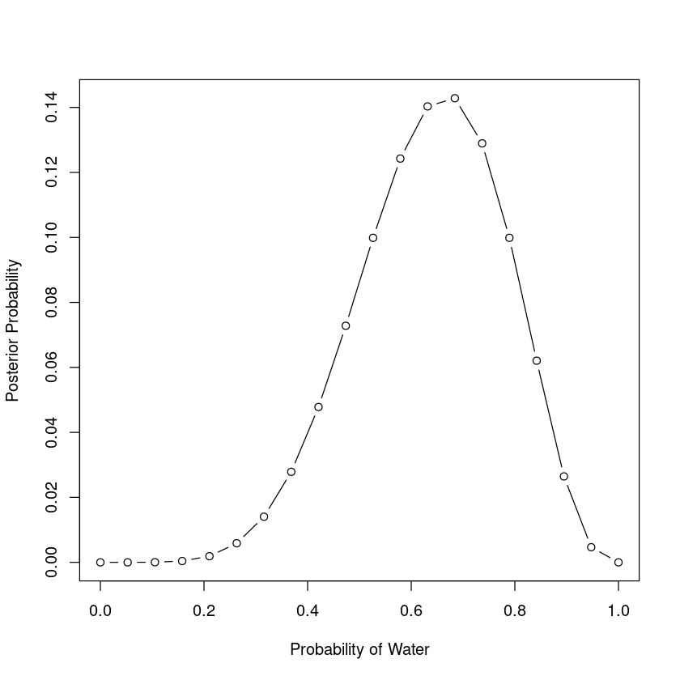

Let's replicate this with different priors. For this, using a function would be a good idea!

```R
calc_with_prior <- function(p_grid, prior) {
    likelihood <- dbinom(6, size=9, prob=p_grid)
    posterior <- prior * likelihood
    posterior <- posterior / sum(posterior)
    return(posterior)
}

p_grid <- seq(from=0, to=1, length.out=50)
prior1 <- ifelse(p_grid < 0.5, 0, 1)

posterior1 <- calc_with_prior(p_grid, prior1)
plot(p_grid, posterior1, xlab="Probability of Water", ylab="Posterior Probability", type="b")
```

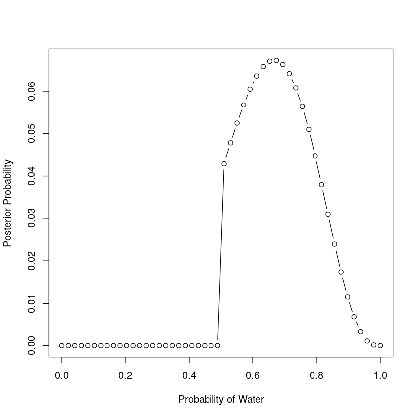

```R
prior2 <- exp(-5 * abs(p_grid - 0.5))
posterior2 <- calc_with_prior(p_grid, prior2)
plot(p_grid, posterior2, xlab="Probability of Water", ylab="Posterior Probability", type="b")
```

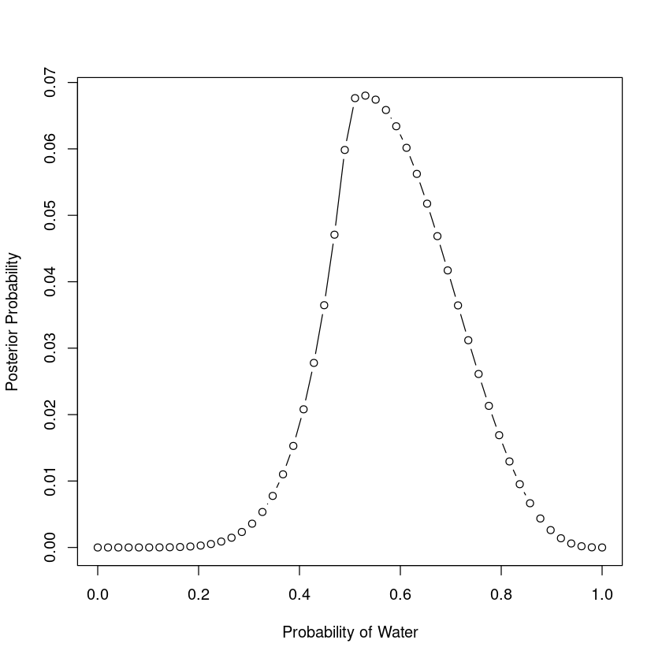

### Quadratic Approximation

While grid approximations are ok as far as they go, but can become unwieldy as the number of parameters increases. Another approach that we can take is the *quadratic approximation*. This approach is to say that near the peak of the distribution, it _basically_ looks Gaussian, which means that we can kind-of sort-of approximate the entire distribution with a Gaussian. This is nice because the Gaussian can be described by only two numbers - the mean and the standard deviation. 

(It's called quadatic because the logarithm of the normal distribution is a parabola).

To do this there are a few steps:
1. Find the mode of the distribution. This is something for which there are many well-developed algorithms which R can use
1. Estimate the curvature of the distribution near the peak.

To do our quadratic approximation, we'll use the `quap` function from the `rethinking` library (goes with the book)

```R
library(rethinking)
globe.qa <- quap(
    alist(
        W ~ dbinom(W+L, p), # binomial likelihood
        p ~ dunif(0, 1)
    ),
    data=list(W=6, L=3)
)
precis(globe.qa)
```

<table class="dataframe">
<caption>A precis: 1 × 4</caption>
<thead>
	<tr><th></th><th scope=col>mean</th><th scope=col>sd</th><th scope=col>5.5%</th><th scope=col>94.5%</th></tr>
	<tr><th></th><th scope=col>&lt;dbl&gt;</th><th scope=col>&lt;dbl&gt;</th><th scope=col>&lt;dbl&gt;</th><th scope=col>&lt;dbl&gt;</th></tr>
</thead>
<tbody>
	<tr><th scope=row>p</th><td>0.6666666</td><td>0.1571338</td><td>0.4155364</td><td>0.9177967</td></tr>
</tbody>
</table>

```R
# Analystical calculation
W <- 6
L <- 3
curve(dbeta(x, W+1, L+1), from=0, to=1)

# quadratic approximation
curve(dnorm(x, 0.67, 0.16), lty=2, add=TRUE)
```

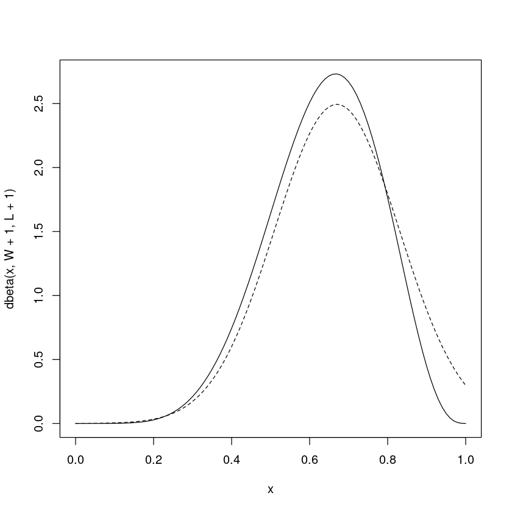


Thedotted line is the quadratic approximation; not great, but it gets better as you add more data.

This is actually pretty common for the normal distribution; stuff starts to look more like it the more data you add.

The quadratic approximation method, either with a uniform prior or lots of data, is often equivalent to a maximum likelihood estimate (MLE) and its standard error. 

## Markov Chain Monte Carlo

The grid method can fail for many parameters, and the quadratic approximation method requires some pretty heroic assumptions. When dealing with multi level models (or just other complex models), with thousands or tens of thousands of parameters, you need something else. [[MCMC]] works by drawing samples from the posterior (without calculating it directly - magic!).

```R
# creating an MCMC
n_samples <- 1000
p <- rep(NA, n_samples)
p[1] <- 0.5
W <- 6
L <- 3
for(i in 2:n_samples) {
    p_new <- rnorm(1, p[i-1], 0.1)
    if (p_new < 0) p_new <- abs(p_new)
    if (p_new > 1) p_new <- 2 - p_new
    q0 <- dbinom(W, W+L, p[i-1])
    q1 <- dbinom(W, W+L, p_new)
    p[i] <- ifelse(runif(1) < q1 / q0, p_new, p[i-1])
}

# the values in p are sammples from the posterior distribution
dens(p, xlim=c(0, 1))
curve(dbeta(x, W+1, L+1), lty=2, add=T)
```

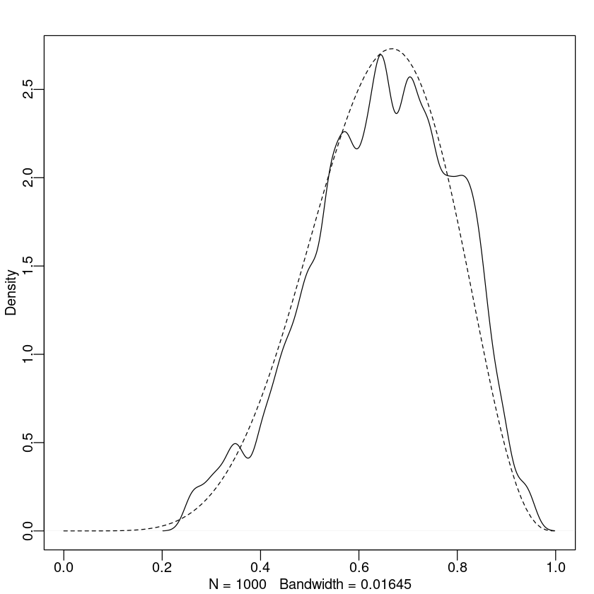

## Practice

### 2E1
(2)

### 2E2
(3)

### E3
(1)

### E4
In our case, it means that from our perspective, were we to toss the globe many times, on average we would expect to see the proportion landing on water being about 0.7

### M1
Recall the globe tossin model from the chapter. Compute and plot the grid approximate posterior distribution for each of the following sets of observations. In each case, assume a uniform prior for `p`.


```R
plot_posterior <- function(water_count, total_count) {
    num_grid <- 101
    ps <- seq(from=0, to=1, length.out=num_grid)
    prior <- rep(1 / num_grid, num_grid)
    likelihood <- dbinom(water_count, total_count, ps)
    posterior <- prior * likelihood
    #plot(ps, posterior, type="b", xlab="Proportion of Water", ylab="Likelihood")
    plot(posterior ~ ps, type="l", xlab="Proportion of Water", ylab="Likelihood")
}
plot_posterior(3, 3)
```

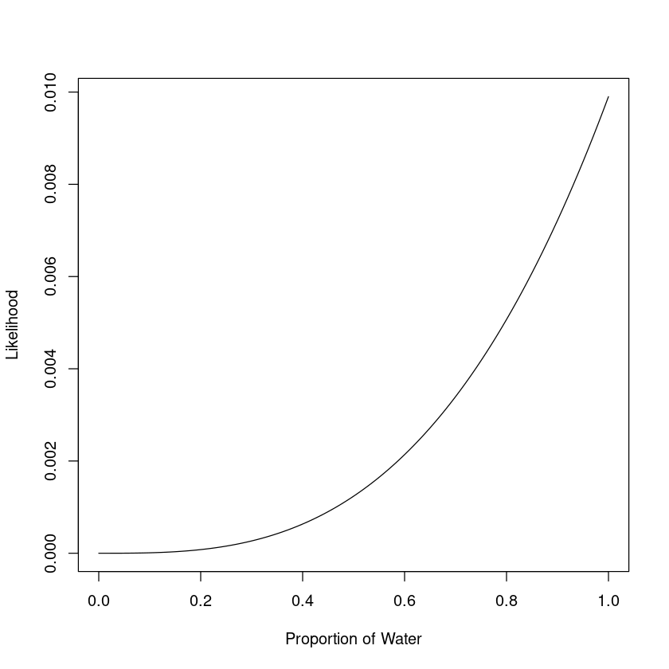

```R
plot_posterior(3, 4)
```

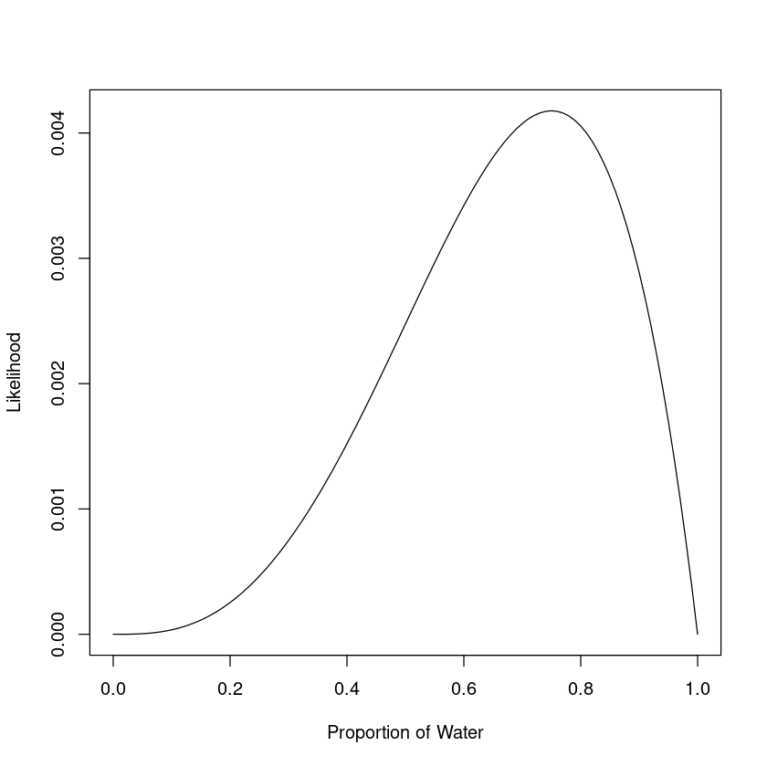

```R
plot_posterior(5, 7)
```
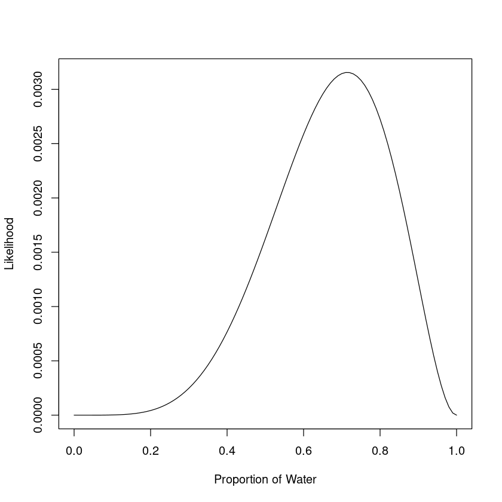

### M2

Now assume a prior for `p` that is equal to 0 when p < 0.5 and some positive constant when p >= 0.5. Again, compute and plot the posterior distributions.


```R
plot_posterior <- function(water_count, total_count) {
    num_grid <- 101
    ps <- seq(from=0, to=1, length.out=num_grid)
    prior <- ifelse(ps < 0.5, 0, 1)
    likelihood <- dbinom(water_count, total_count, ps)
    posterior <- prior * likelihood
    posterior <- posterior / sum(posterior)
    #plot(ps, posterior, type="b", xlab="Proportion of Water", ylab="Likelihood")
    plot(posterior ~ ps, type="l", xlab="Proportion of Water", ylab="Likelihood")
}

plot_posterior(3, 3)
```

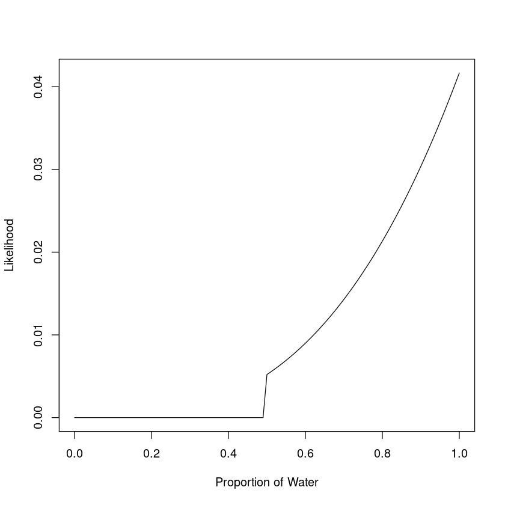

```R
plot_posterior(3, 4)
```
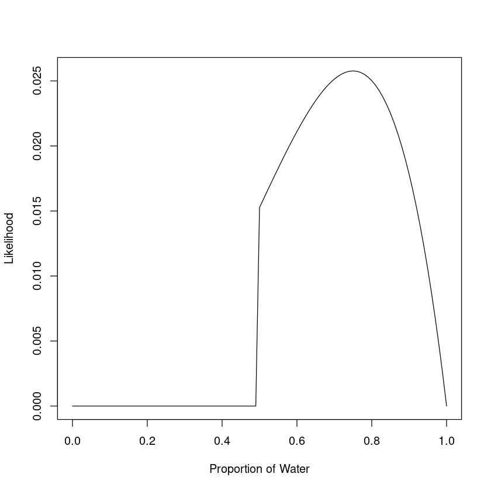

```R
plot_posterior(5, 7)
```

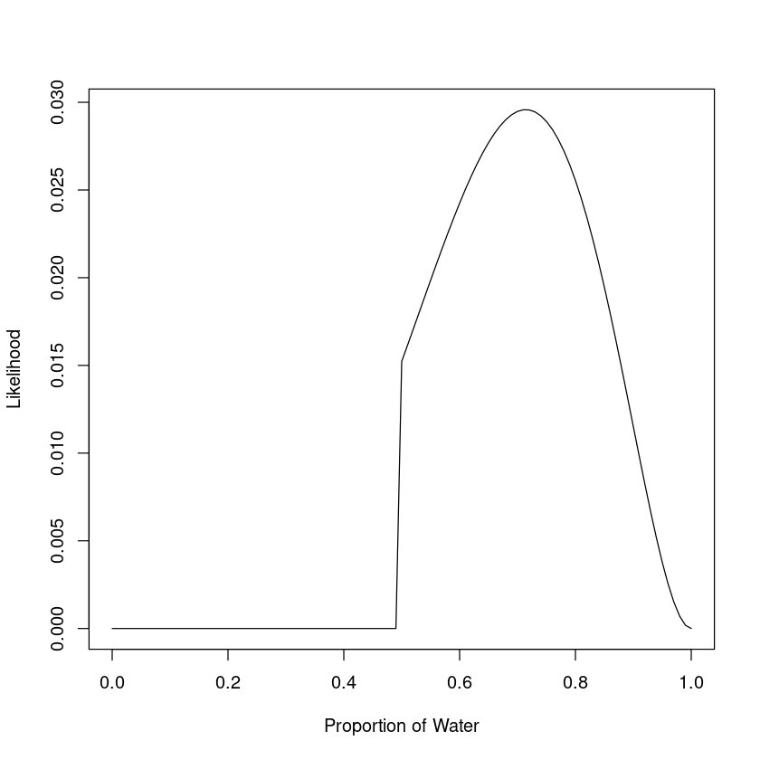

### M3

Two globes, one for Earth and one for Mars. The Earth one is 70% water, the Mars 0%. One of the globes is tossed, and produces an observation of "Land". If each globe was equally likely to be tossed, then show that the posterior probability that the globe was Earth, conditioned on it producing the "Land" observation, is 0.23

$$
\begin{align*}
P(E|L) &= P(E) \ast \frac{P(L|E)}{P(L)} \\
    &= 0.5 \ast \frac{0.3}{0.5 * 0.3 + 0.5 * 1} \\
    &= 0.23076\dots
\end{align*}
$$

### M4

Deck with three cards. Each card has two sides, each either black or white. One cards has two black sides. The second card has one black and one white side. The third has two white sides. Now suppose that the cards are put in a bag, and one is removed and placed on the table. Show that the probability that the other side is black is 2/3. Use the counting method.


### M5
4 / 5


### M6
Now imagine the black ink is heavier - for time you pull the BB, you pull the BW twice and the WW thrice. Again suppose that you grab a card and put it on the table, and the side facing up is B. Show that the probability that the other side is black is 0.5.

| Card | Ways to Draw | Black Sides | Total Ways |
|---|---|---|---|
|BB | 1 | 2 | 2 |
|BW | 2 | 1 | 2 |
|ww | 3 | 0 | 0 |

BB / total -> 2 / 4 -> 0.5

### M7

Assume the original card problem, with the black side facing up. Now, however, we choose another card and place it on the table. The side facing up on the new card is white. Show that now the probability that the other side is black is 0.75. Hint: treat this like a sequence of globe tosses, counting all the ways to see each observation for each possible first card

First card: 
    - BB. 2 ways to get the first observation. Then we have BW and WW, leaving three ways to get the second -> 6
    - BW. 1 way to get the first observation. Then we have BB and WW, leaving 2 to get the second -> 2
    - WW. 0 ways to get the first -> 0
6 / (6 + 2) -> 3/4

### H1
Two species of panda, indentical in every way, except that species A gives birth to twins 10% of the time and single births the rest, while species B gives birth to twins 20% of the time and single births the rest.

A new panda gives birth to twins. What is the probability that the next birth will also be twins?

$$
\begin{align*}
P(t_2 | t_1) &= \frac{P(t_2, t_1)}{p(t_1)} \\
\end{align*}
$$

$$
\begin{align*}
P(t_1) &= 0.5 * 0.1 + 0.5 * 0.2 \\
        &= 0.15 \\
P(t_1, t_2) &= 0.5 * 0.1 ^ 2 + 0.5 * 0.2 ^ 2 \\
        &= 0.025 \\
p(t_2 | t_1) &= 0.025 / 0.15 \\
        &= 0.1666\dots \\
        &= 1/6
\end{align*}
$$

$$
\begin{align*}
P(t_2 | t_1) &= P(t_2) \ast \frac{P(t_1|t_2)}{P(t_1)} \\
\end{align*}
$$

### H2

Now compute the probability that the panda was species A, assuming that we just have the first birth.

$$
\begin{align*}
P(A|t) &= P(A) \ast \frac{P(t|A)}{P(T))} \\
    &= 0.5 \ast \frac{0.1}{0.5 * 0.1 + 0.5 * 0.2} \\
    &= 0.5 \ast \frac{0.1}{0.15} \\
    &= \frac{1}{3} \\
\end{align*}
$$

### H3

Now that same panda gives birth again, but to a single infant this time. Update the probability that it is of species A.

$$
\begin{align*}
P(A|s) &= P(A) \frac{P(s|A)}{P(s)} \\
    &= \frac{1}{3} \ast \frac{0.9}{\frac{1}{3} \ast 0.9 + \frac{2}{3} \ast 0.8} \\
    &= 0.36
\end{align*}
$$

### H4

Now let's add in some totally different data. Say a geneticist develops a test, which has the following properties:
- The probability it correctly identifies species A is 0.8
- The probability it correctly identifies species B is 0.65

She administers the test to the panda, and finds that it is positive for species A

1. Ignore all of the birth data, and find the probability that it is of species A
2. Now add in the birth data and re-compute the probability it is of species A

1.
$$
\begin{align*}
P(A|+) &= P(A) \ast \frac{P(+|A)}{P(+)} \\
    &= 0.5 \ast \frac{0.8}{0.5 \ast 0.8 + 0.5 \ast (1-0.65)} \\
    &= 0.695\dots
\end{align*}
$$

```R
0.5 * (0.8 / (0.5 * 0.8 + 0.5 * 0.35))
```
0.695652173913044


2. The posterior with the birth data is 0.36, so we can just do an update!

$$
\begin{align*}
P(A|+) &= P(A) \ast \frac{P(+|A)}{P(+)} \\
    &= 0.0.36 \ast \frac{0.8}{0.36 \ast 0.8 + 0.64 \ast (1-0.65)} \\
    &= 0.5625
\end{align*}
$$

```R
0.36 * (0.8 / (0.36 * 0.8 + 0.64 * 0.35))
```
0.5625

```R
0.5 * (0.1 ^ 2 + 0.2 ^ 2)
```
0.025

```R
0.025 / 0.15
```
0.166666666666667

```R
(1/3) * 0.9 / sum(c(1/3, 2/3) * c(0.9, 0.8))
```
0.36